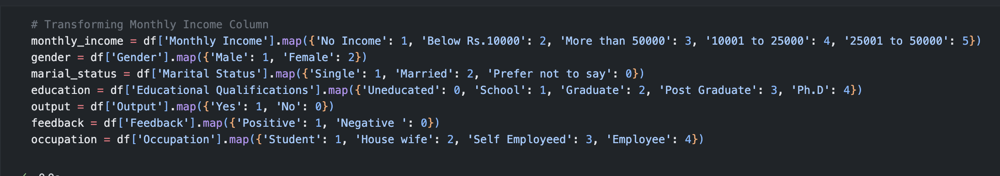
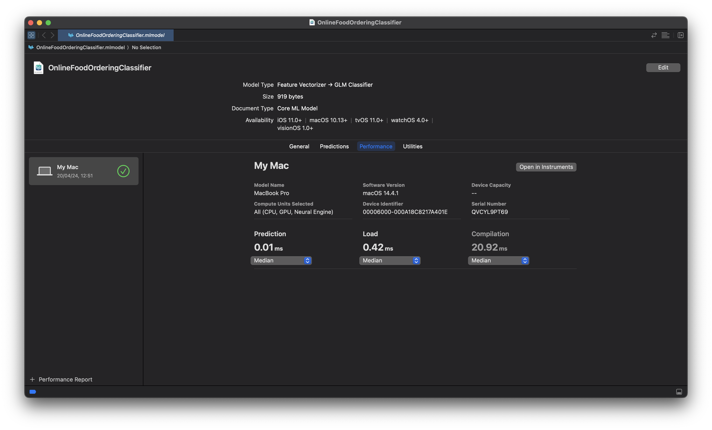
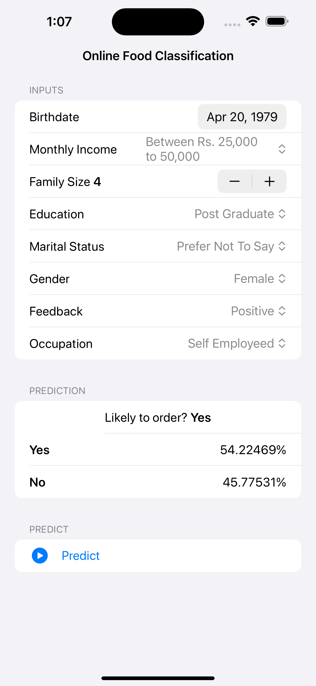

# Online Food Classification

- **This Project is a demo of using [Online Food Dataset](https://www.kaggle.com/datasets/sudarshan24byte/online-food-dataset/) to classify how likey one is to order food online**

## CoreML Model [link](models/OnlineFoodOrderingClassifier.mlmodel)

## Input Mapping for App

## Notebook to clean my data
[jupyter notebook](food_book.ipynb)

## Predictions

## Playground of how I built the model
[ML Playground](FoodData.playground)

## App Demo [link](OnlineFoodOrderingClassifier/OnlineFoodOrderingClassifier/ContnetView+ViewModel.swift)

[Video](https://github.com/c2p-cmd/OnlineFoodClassification/raw/master/ss/video.mp4)
